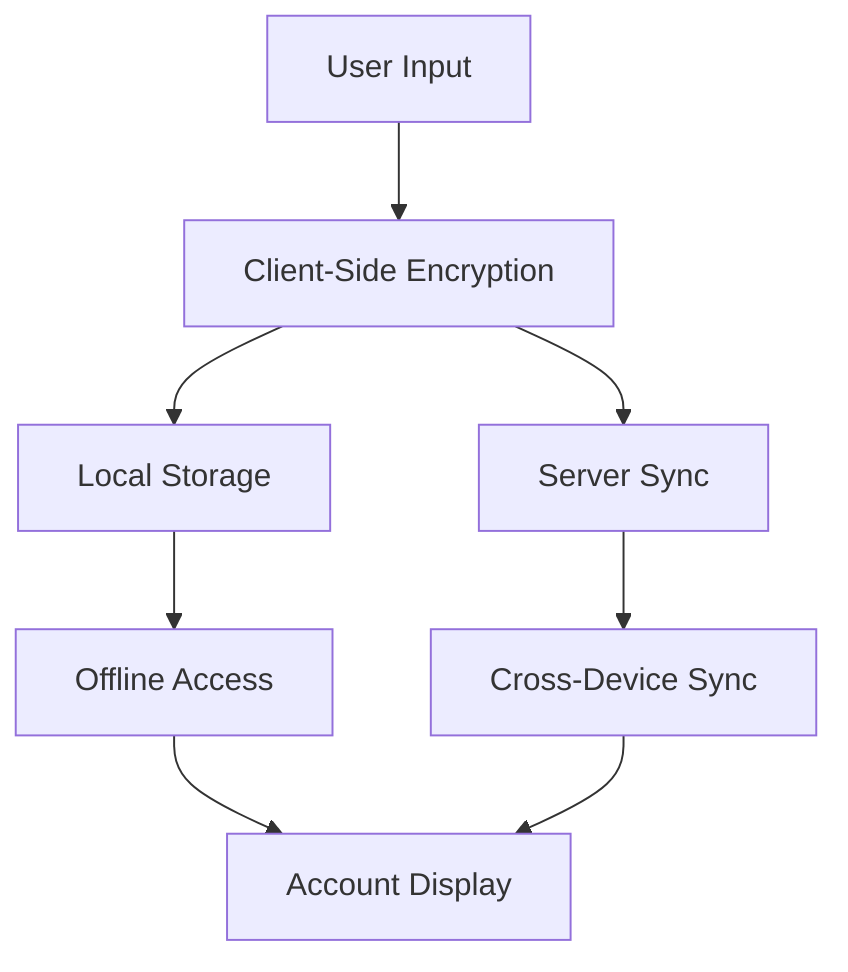

# Jisme

[](https://github.com/ismailnguyen/Jisme)
[](LICENSE.txt)
[](https://vuejs.org/)
[](https://web.dev/progressive-web-apps/)

**Jisme** is an open-source, client-side password manager built as a Progressive Web App (PWA). It provides secure password management with advanced encryption, passwordless authentication, and support for various account types including credentials, credit cards, and TOTP (Time-based One-Time Password) tokens.

🌐 **Live Demo**: [https://jisme.app](https://jisme.app)

## 🚀 Features

### Security Features
- **Client-Side Encryption**: All data is encrypted locally using the Stanford JavaScript Crypto Library (SJCL)
- **Zero-Knowledge Architecture**: Server never stores unencrypted data
- **PBKDF2 Key Derivation**: Strong key derivation with 100,000 iterations
- **Multi-Factor Authentication**: Support for TOTP, WebAuthn (Passkeys), and traditional passwords
- **Passwordless Generation**: Deterministic password generation based on site + login + master password

### Account Management
- **Multiple Account Types**: 
  - Login credentials with password/passwordless options
  - Credit/debit cards with secure storage
  - TOTP tokens for 2FA
  - Custom notes and descriptions
- **Smart Organization**: Tags, favorites, recent accounts, and search functionality
- **Duplicate Detection**: Automatic detection and management of duplicate accounts
- **Import/Export**: Secure backup and restore capabilities

### User Experience
- **Progressive Web App**: Install on any device, works offline
- **Responsive Design**: Optimized for desktop and mobile devices
- **Dark/Light Theme**: Automatic theme detection and manual override
- **QR Code & Barcode Generation**: For easy sharing of account information
- **Advanced Search**: Filter by tags, account types, and content
- **Activity Tracking**: Monitor account usage and modification history

### Technical Features
- **Offline-First**: Full functionality without internet connection
- **Modern Vue.js**: Built with Vue 3 and Composition API
- **State Management**: Centralized state with Pinia
- **Local Storage**: IndexedDB via LocalForage for secure local data
- **API Integration**: Sync with backend server when available
- **Chunked Operations**: Efficient handling of large datasets

## 🏗️ Architecture

### Frontend Stack
- **Vue.js 3.3.4**: Modern reactive framework with Composition API
- **Vite 4.4.9**: Fast build tool and development server
- **Pinia 2.1.7**: State management library
- **Vue Router 4.2.4**: Client-side routing
- **Bootstrap 5.3.3**: UI component framework
- **FontAwesome 6.5.1**: Icon library

### Cryptography & Security
- **SJCL (Stanford JavaScript Crypto Library)**: AES encryption
- **js-sha256**: SHA-256 hashing
- **PBKDF2**: Key derivation function
- **WebAuthn**: Passwordless authentication
- **TOTP Generator**: Time-based one-time passwords

### Storage & Data
- **LocalForage**: Async storage (IndexedDB/WebSQL/localStorage)
- **Chunked Processing**: Handle large datasets efficiently
- **Caching Strategy**: Smart caching for offline functionality

## 📱 Account Types

### 1. Login Credentials
```javascript
{
  type: 'account',
  subtype: 'login',
  label: 'GitHub',
  platform: 'github.com',
  login: 'username@example.com',
  password: 'encrypted_password',
  is_password_less: true,
  password_clue: 'Optional hint',
  totp_secret: 'TOTP_SECRET_KEY'
}
```

### 2. Payment Cards
```javascript
{
  type: 'card',
  subtype: 'credit',
  card_name: 'John Doe',
  card_number: '1234 5678 9012 3456',
  card_expiracy: '12/25',
  card_cryptogram: '123',
  card_pin: '1234'
}
```

### 3. Bank Accounts
```javascript
{
  type: 'bank',
  subtype: 'iban',
  card_number: 'FR1420041010050500013M02606'
}
```

## 🛠️ Development Setup

### Prerequisites
- Node.js (v22+ recommended)
- npm or yarn package manager

### Installation
```bash
# Clone the repository
git clone https://github.com/ismailnguyen/Jisme.git
cd Jisme

# Install dependencies
npm install
```

### Development Commands
```bash
# Start development server with hot reload
npm run dev

# Build for production
npm run build

# Preview production build
npm run preview
```

### Environment Variables
Create a `.env` file in the root directory:
```env
VITE_PASSKEY_CHALLENGE=your-passkey-challenge
VITE_PASSKEY_RP_NAME=Jisme
VITE_API_BASE_URL=https://your-api-server.com/api
```

## 🔒 Security Implementation

### Encryption Flow
1. **Master Password**: User's master password is hashed with SHA-256
2. **Account Encryption**: Each account is encrypted using SJCL with the hashed master password
3. **Storage**: Encrypted data is stored locally via LocalForage
4. **Server Sync**: Only encrypted data is transmitted to the server

### Passwordless Authentication
Jisme implements a unique passwordless system:
1. **Deterministic Generation**: Passwords are generated using PBKDF2(platform + login + counter, master_password)
2. **No Storage**: Passwords are generated on-demand, never stored
3. **Reproducible**: Same inputs always produce the same password
4. **Configurable**: Length and character sets are customizable

### TOTP Integration
- **Secret Storage**: TOTP secrets are encrypted and stored securely
- **Code Generation**: Real-time TOTP code generation
- **QR Code Display**: Visual QR codes for easy setup

## 📊 Data Flow



## 🚀 Deployment

### Static Hosting
The app can be deployed to any static hosting service:
```bash
npm run build
# Deploy the 'dist' folder to your hosting provider
```

### PWA Configuration
The app is automatically configured as a PWA with:
- Service Worker for offline functionality
- Web App Manifest for installation
- Optimized icons and splash screens
- Automatic updates

## 🤝 Contributing

1. Fork the repository
2. Create a feature branch: `git checkout -b feature-name`
3. Make your changes and test thoroughly
4. Commit your changes: `git commit -m 'Add feature-name'`
5. Push to your branch: `git push origin feature-name`
6. Submit a pull request

### Development Guidelines
- Follow Vue.js best practices
- Maintain security-first approach
- Test encryption/decryption flows
- Ensure PWA compatibility
- Write clear commit messages

## 📄 License

This project is licensed under the MIT License - see the [LICENSE.txt](LICENSE.txt) file for details.

## 🙏 Acknowledgments

- **Stanford JavaScript Crypto Library** for robust encryption
- **Vue.js community** for the excellent framework
- **WebAuthn specification** for passwordless authentication
- **Bootstrap team** for the UI framework

## 📞 Support

- **Issues**: [GitHub Issues](https://github.com/ismailnguyen/Jisme/issues)
- **Author**: Ismaïl <dev@ismailnguyen.com>
- **Website**: [https://jisme.app](https://jisme.app)

---

⭐ **Star this repository** if you find Jisme useful for your password management needs!
